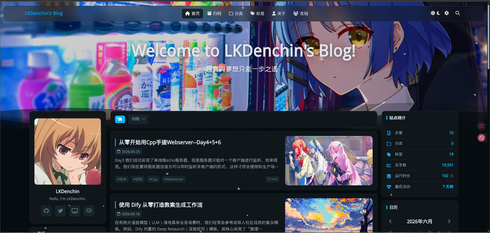
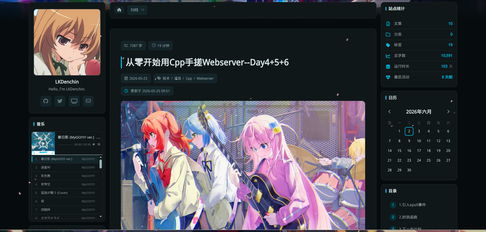
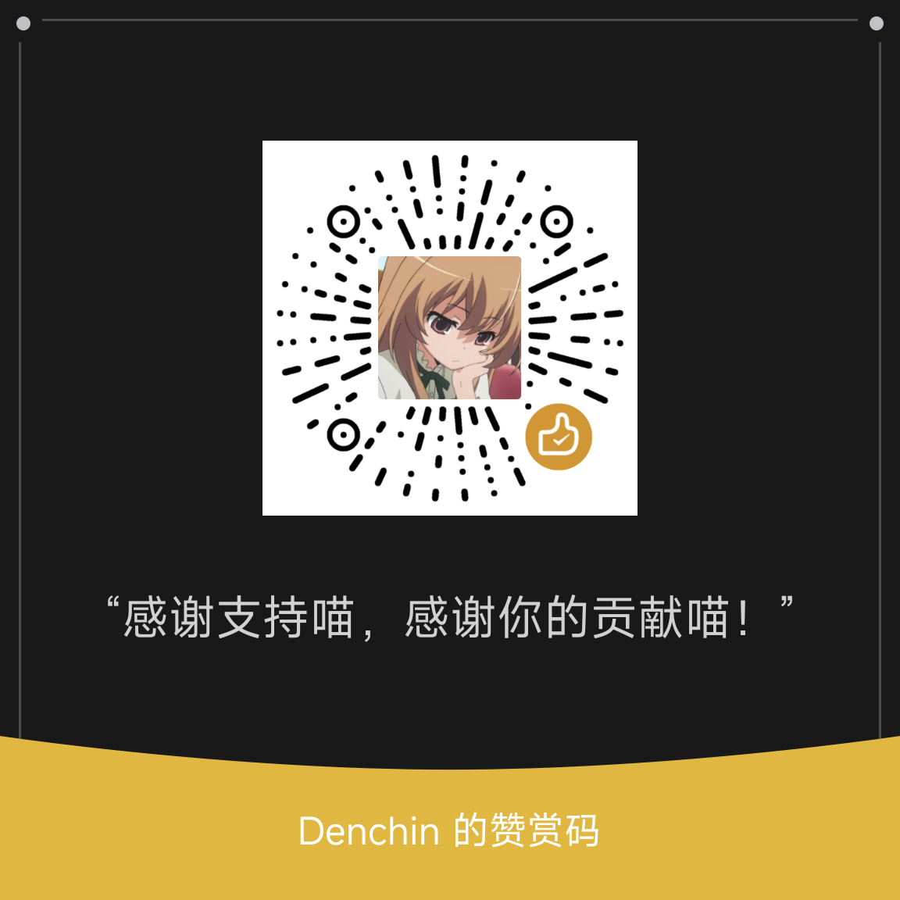

<div align="center">

# Firefly
> A clean and beautiful Hexo blog theme

> 
> 
> 
> 

</div>

---

📖 README：
**[简体中文](README.md)** | **[English](README.en.md)**

🚀 Demo Site:
[**🖥️ My Blog**](https://blog.lkdenchin.cn/)

---

## 📸 Preview

| Homepage | Post Page |
|:---:|:---:|
|  |  |

---

Firefly is a clean, beautiful, and modern Hexo blog theme, ported from the original [Astro-based Firefly theme](https://github.com/CuteLeaf/Firefly) developed by [CuteLeaf](https://github.com/CuteLeaf). It fully preserves all features and design of the original. With rich functional modules and a highly customizable interface, you can easily build a professional and beautiful personal blog.

Firefly supports dual sidebars, list/grid article views, and features widgets such as site statistics, calendar, TOC, music player, and category navigation. It also supports share buttons, related post recommendations, and previous/next post navigation.

---

## ✨ Features

### Core

- [x] **Hexo + EJS Templates** - High-performance static blog
- [x] **Responsive Design** - Desktop, tablet, and mobile
- [x] **i18n** - UI: zh-CN, zh-TW, English, Japanese, Russian
- [x] **Local Search** - XML-based full-text search
- [x] **Sakura Petal Effect** - Toggle-able cherry blossom animation
- [x] **Typewriter Effect** - Homepage title animation

### Personalization

- [x] **Dynamic Sidebars** - Single or dual sidebar
- [x] **Article Layouts** - List, grid, switchable on frontend
- [x] **Light/Dark Mode** - Light, dark, or follow system
- [x] **Custom Theme Color** - 360° hue adjustment
- [x] **Wallpaper Modes** - Banner, fullscreen, overlay, or solid color
- [x] **Water Waves Effect** - Dynamic wave animation
- [x] **Customizable Navbar** - Logo, title, menu links
- [x] **Configurable Footer** - HTML injection, fully customizable

### Posts & Content

- [x] **Cover Images** - Post cover with random API support
- [x] **Table of Contents (TOC)** - Auto-generated floating TOC
- [x] **Syntax Highlighting** - Highlight.js-based
- [x] **Collapsible Code Blocks** - Auto-collapse long blocks
- [x] **Mermaid Diagrams** - Mermaid syntax rendering
- [x] **PlantUML Diagrams** - PlantUML rendering
- [x] **Image Lightbox** - Fancybox click-to-zoom
- [x] **Encrypted Posts** - Password protection
- [x] **Outdated Post Notice** - Auto-display for old posts
- [x] **Copyright Notice** - Custom license info

### Comment Systems

- [x] **Giscus** / **Twikoo** / **Waline** / **Artalk** / **Disqus**

### Sidebar Widgets

- [x] **Profile Card** - Avatar, name, bio, social links
- [x] **Announcement** - Closable announcement bar
- [x] **Music Player** - MetingJS online / local music
- [x] **Category Navigation** - Quick category list
- [x] **Tag Cloud** - Tag aggregation
- [x] **Site Stats** - Post count, categories, tags, running days
- [x] **Calendar** - Post publishing calendar view

### Standalone Pages

- [x] **Friends** / **Sponsor** / **Guestbook** / **Gallery** / **About**

### Analytics

- [x] **Busuanzi** / **Baidu Analytics** / **Google Analytics** / **Microsoft Clarity** / **Umami** / **51.LA**

### Others

- [x] **Mascot** - Spine skeletal animation / Live2D model
- [x] **Banner Carousel** - Auto-rotating wallpapers
- [x] **Display Settings Panel** - Frontend customizable toggles

---

## 🚀 Quick Start

### Requirements

- Node.js >= 16
- Hexo >= 6.x

### Installation

1. **Navigate to your Hexo site directory:**
   ```bash
   cd your-hexo-blog
   ```

2. **Clone the theme:**
   ```bash
   git clone https://github.com/LKDenchin/hexo-theme-firefly.git themes/firefly
   ```

3. **Set the theme** in site root `_config.yml`:
   ```yaml
   theme: firefly
   ```

   > **Note**: You must set `theme: firefly` in the site root `_config.yml`.

4. **Install required plugins:**
   ```bash
   npm install hexo-generator-search --save
   npm install hexo-wordcount --save
   ```

5. **Create pages (optional):**
   ```bash
   hexo new page about
   hexo new page friends
   hexo new page categories
   hexo new page tags
   ```

6. **Configure:** Edit `themes/firefly/_config.yml`.

7. **Start server:**
   ```bash
   hexo clean && hexo server
   ```
   Blog available at `http://localhost:4000`

---

## 📖 Configuration

All settings in `themes/firefly/_config.yml`:

```
themes/firefly/
├── _config.yml          # Main config file
├── _data/               # Data files (friends, etc.)
├── languages/           # i18n (zh-CN / zh-TW / en / ja / ru)
├── layout/              # EJS templates
├── scripts/             # Helpers, generators, tags
└── source/              # Static assets
```

### Site Language

In site root `_config.yml`:

```yaml
language: zh-CN
```

Supports: `zh-CN` `zh-TW` `en` `ja` `ru`

### Key Sections

| Section | Description |
|:--------|:------------|
| `theme_color` | Theme hue (0-360), light/dark/system mode |
| `nav` | Navbar: logo, title, menu |
| `wallpaper` | Background modes: banner / fullscreen / overlay / none |
| `sidebar` | Left/right sidebar widgets |
| `post` | Cover, TOC, copyright, navigation |
| `post_list_layout` | Article layout: list / grid / masonry |
| `comments` | giscus / twikoo / waline / artalk / disqus |
| `music` | Music player (MetingJS / local) |
| `effects` | Sakura petals |
| `pio` | Mascot (Spine / Live2D) |
| `analytics` | Baidu / Google / Umami etc. |
| `search` | Local search |
| `code` | Highlight theme, collapsible |
| `mermaid` | Mermaid diagrams |
| `plantuml` | PlantUML diagrams |
| `font` | Custom fonts |
| `footer` | Footer settings |
| `sponsor` | Sponsor page |
| `gallery` | Gallery |
| `friends_page` | Friends page |

---

## 🧩 Post Front-matter

```yaml
---
title: My First Post
date: 2025-01-01 12:00:00
updated: 2025-01-02 18:00:00
tags: [Hexo, Blog]
categories: Technology
description: Post description
cover: /img/cover.jpg  # Post cover image
top: true              # Pin this post
toc: true              # Show table of contents
comments: true         # Enable comments
copyright: true        # Show copyright notice
password: ""           # Encrypt post (leave empty to disable)
---
```

---

## 🧞 Commands

| Command | Action |
|:--------|:-------|
| `hexo clean` | Clean cache and generated files |
| `hexo server` | Start local dev server |
| `hexo generate` | Generate static files |
| `hexo deploy` | Deploy the site |
| `hexo new post "Title"` | Create a new post |
| `hexo new page "Name"` | Create a new page |

---

## ❤️ Sponsor

If this theme helps you, feel free to buy me a coffee~



---

## 🙏 Credits

Special thanks to [saicaca](https://github.com/saicaca) for [fuwari](https://github.com/saicaca/fuwari), and [CuteLeaf](https://github.com/CuteLeaf) for [Firefly](https://github.com/CuteLeaf/Firefly). This project is the Hexo port of Firefly.

Some Firefly-related image assets are copyrighted by [Honkai: Star Rail](https://sr.mihoyo.com/) developer [miHoYo](https://www.mihoyo.com/).

### Tech Stack

- [Hexo](https://hexo.io) - Blog framework
- [EJS](https://ejs.co) - Template engine
- [Highlight.js](https://highlightjs.org) - Code highlighting
- [MetingJS](https://github.com/metowolf/MetingJS) - Music player
- [Fancybox](https://fancyapps.com/fancybox/) - Image lightbox

### References

- [Firefly](https://github.com/CuteLeaf/Firefly) - Original Astro theme (CuteLeaf)
- [fuwari](https://github.com/saicaca/fuwari) - Astro blog template (saicaca)
---

## 📝 License

MIT License.

**Copyright:**
- Copyright (c) 2024 [saicaca](https://github.com/saicaca) - [fuwari](https://github.com/saicaca/fuwari)
- Copyright (c) 2025 [CuteLeaf](https://github.com/CuteLeaf) - [Firefly](https://github.com/CuteLeaf/Firefly)
- Copyright (c) 2026 [LKDenchin](https://github.com/LKDenchin) - [hexo-theme-firefly](https://github.com/LKDenchin/hexo-theme-firefly)

---

## ⭐ Star History

## Star History

<a href="https://www.star-history.com/?repos=LKDenchin%2Fhexo-theme-firefly&type=date&legend=top-left">
 <picture>
   <source media="(prefers-color-scheme: dark)" srcset="https://api.star-history.com/chart?repos=LKDenchin/hexo-theme-firefly&type=date&theme=dark&legend=top-left" />
   <source media="(prefers-color-scheme: light)" srcset="https://api.star-history.com/chart?repos=LKDenchin/hexo-theme-firefly&type=date&legend=top-left" />
   
 </picture>
</a>
